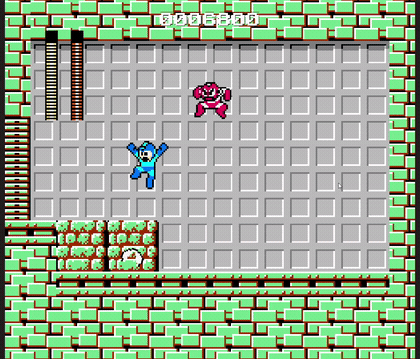

# Mega Man (1987) — Recreation

A recreation of the NES-era **Mega Man** built in **Unity (C#)**, as the final project for
*Introduction to Unity* — the first course of the HUJI × Bezalel Game Design & Development minor.

Run-and-gun platforming, ladder climbing, screen-by-screen room transitions, power-up drops, and a
**Cut Man** boss fight with his Rolling Cutter.

<!-- Add a gameplay GIF here — drop the file in docs/ and uncomment:

-->

## Highlights

- **State-pattern player movement** — `IMovementState` (`EnterState` / `UpdateState` / `ExitState`)
  with `GroundedState`, `InAirState`, and `ClimbingState` implementations, driven through an
  `IMovementContext` abstraction. Each state owns its own transitions, so movement behaviour stays
  readable instead of collapsing into one giant `Update()`.
- **Object pooling throughout** — a generic `MonoPool` plus `IPoolable`, specialised into
  `MegaManBulletPool`, `BlasterBulletPool`, and an `AudioSourcePool` with `PooledAudioSource`.
  Pooling the audio sources (not just the bullets) keeps rapid-fire SFX from allocating.
- **Event-driven systems** — a central `GameEvents` hub decouples health, score, drops, and UI from
  the gameplay code that triggers them.
- **Classic room transitions** — `CameraTransitionManager` and `BossRoomTransition` reproduce
  Mega Man's screen-locked scrolling and the boss-door approach.
- **Boss fight** — `CutManController` with a dedicated animation controller and the `RollingCutter`
  projectile.
- **Power-up drops** — extra points and a `TimeSlower` slow-motion pickup.

## Architecture

```
Assets/Scripts/
├── Mega man/
│   ├── PlayerController.cs        # movement context + input
│   ├── PlayerShoot.cs
│   ├── PlayerAnimationController.cs
│   └── States/                    # GroundedState, InAirState, ClimbingState
├── Bosses/Cut Man/                # CutManController + animation controller
├── Enemies/Blaster/               # controller, animator, spawner
├── Projectiles/                   # MegaManBullet, BlasterBullet, RollingCutter
├── Pools/                         # MonoPool, bullet pools, AudioSourcePool
├── Managers/                      # Game, Health, Sound, Drops, MonoSingleton
├── Camera/                        # CameraTransitionManager, BossRoomTransition
├── Drops/                         # ExtraPoints, TimeSlow power-ups
├── Events/GameEvents.cs
├── Interfaces/                    # IMovementState, IMovementContext, IPoolable
└── UI/, StartScreen/, EndScreen/, Ladder/, Environment/
```

## Tech

Unity · C# · New Input System · DOTween · State pattern · Object pooling · Event-driven architecture

## Credits

Solo project by **Rami Hubeishi** ([@FlubbedTulip](https://github.com/FlubbedTulip)).

Non-commercial fan recreation built for educational purposes. *Mega Man* and all associated
characters, art, and audio are the property of **Capcom**.
